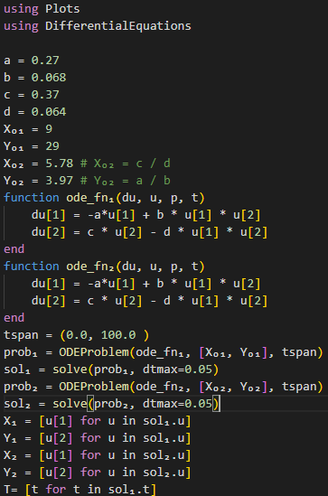
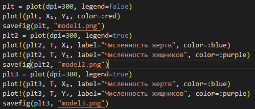
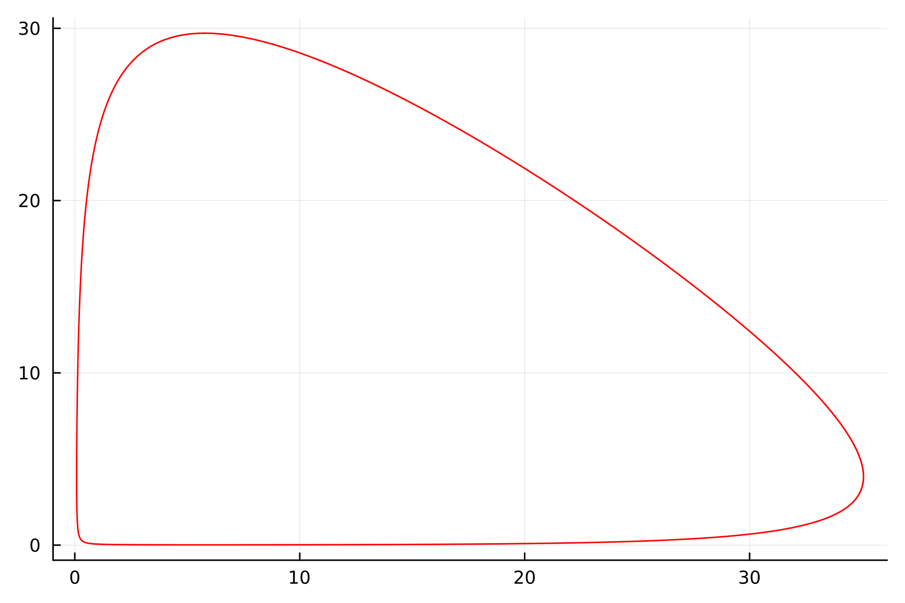
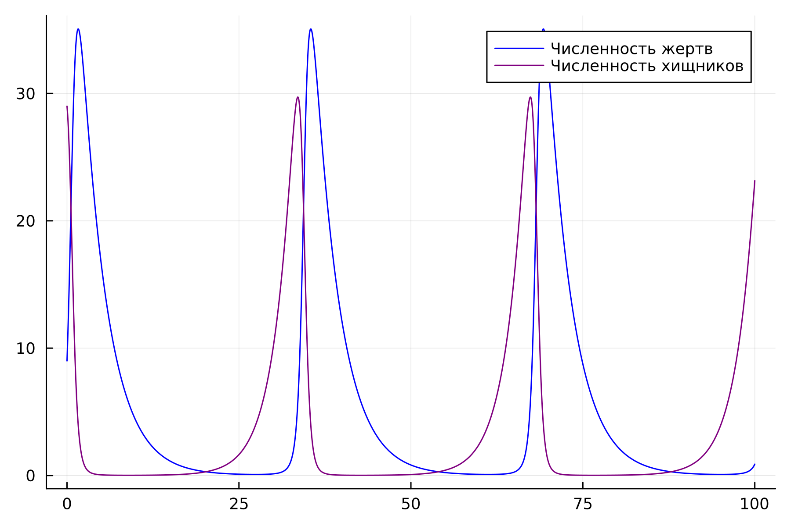
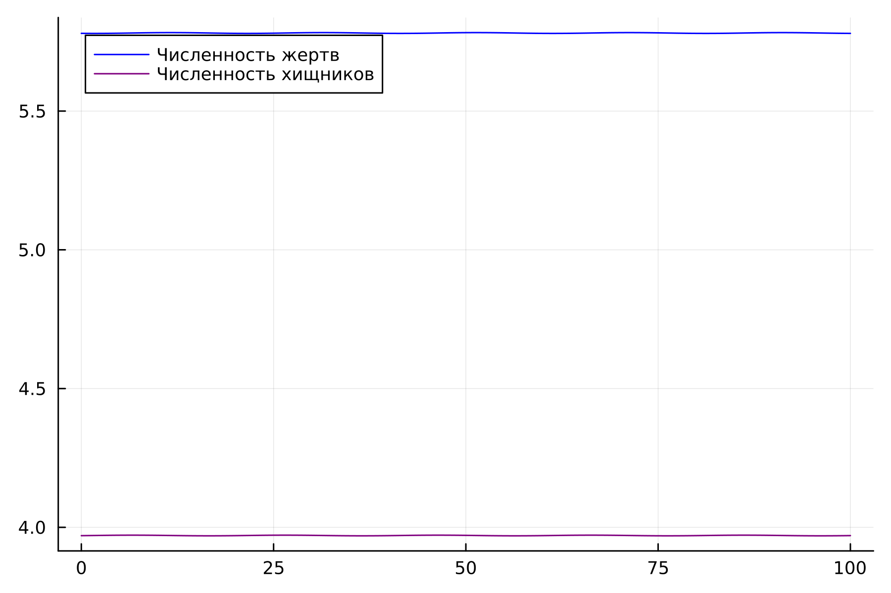
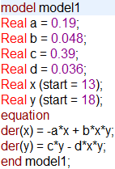
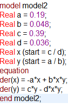
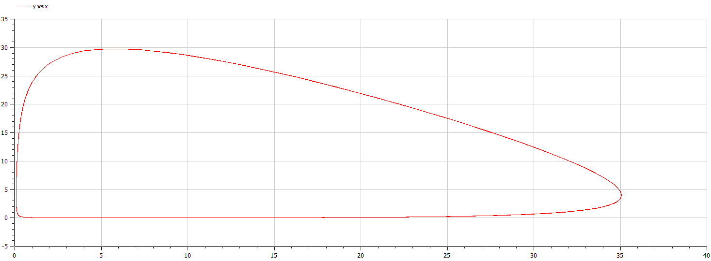
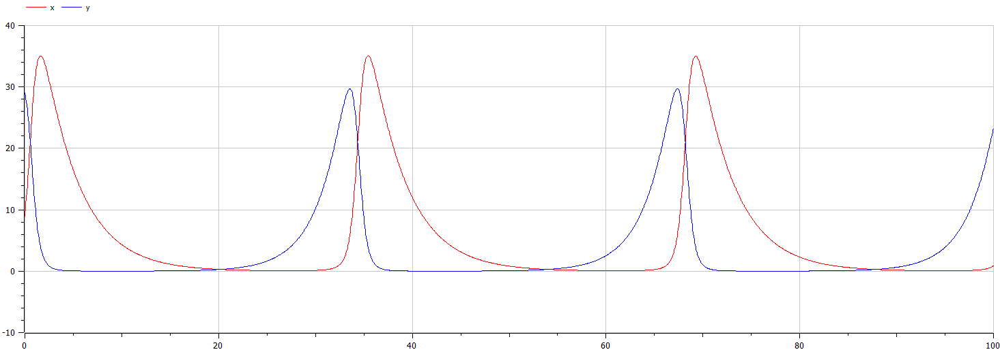
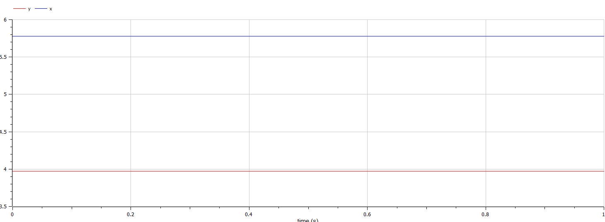

---
## Front matter
lang: ru-RU
title: Модель хищник-жертва
subtitle: Лабораторная работа №5
author:
  - Покрас Илья Михайлович 
institute:
  - Российский университет дружбы народов, Москва, Россия
date: 2 марта 2023

## i18n babel
babel-lang: russian
babel-otherlangs: english

## Formatting pdf
toc: false
toc-title: Содержание
slide_level: 2
aspectratio: 169
section-titles: true
theme: metropolis
header-includes:
 - \metroset{progressbar=frametitle,sectionpage=progressbar,numbering=fraction}
 - '\makeatletter'
 - '\beamer@ignorenonframefalse'
 - '\makeatother'
---

## Цели

Целью данной работы является построение модели хищник-жертва.

## Задачи

1. Построить график зависимости численности хищников от численности жертв

2. Построить график зависимости численности хищников и численности жертв от времени

3. Найти стационарное состояние системы

## Ход работы

Код Julia(@fig:001 - @fig:002):

{#fig:001 height=75%}

## Ход работы

{#fig:002 height=75%}

## Ход работы

Результаты(@fig:003 - @fig:005):

{#fig:003 height=75%}

## Ход работы

{#fig:004 height=75%}

## Ход работы

{#fig:005 height=75%}

## Ход работы

Код на OpenModelica(@fig:006 - @fig:007)

{#fig:006 height=75%}

## Ход работы

{#fig:007}

## Ход работы

Результат(OpenModelica) (@fig:008 - @fig:010)

{#fig:008 height=75%}

## Ход работы

{#fig:009 height=75%}

## Ход работы

{#fig:010 height=75%}

## Результаты

В ходе выполнения лабораторной работы была изучена модель хищник-жертва и построены математические модели.